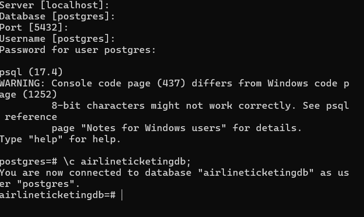

### Topic - Unit 2 Blog
----

#### Before learning 
----
Before starting this unit, my understanding of databases was mostly basic-level. I knew that databases store data and that SQL is used to retrieve information, but I didn’t fully understand the underlying mechanics. I believed that as long as the data was stored in tables, everything would work perfectly. I used to think that simply adding tables and linking them with foreign keys was enough to maintain relationships between data.Additionally, I never thought about how databases optimize queries before executing them. 

----

#### Key Takeaways from the Unit
----

During this unit, I explored fundamental concepts in database systems, particularly focusing on relational algebra, entity-relationship diagrams (ERDs), and relational schema design. These topics form the foundation of how databases are structured, queried, and maintained.

Relational Algebra provided insights into the theoretical framework of querying databases. I learned about operations such as Selection (σ), Projection (Π), Union (∪), Intersection (∩), Difference (-), Cartesian Product (×), and Join (⋈). These operations help retrieve and manipulate data effectively, forming the basis for SQL queries.

The Entity-Relationship Model (ERD) introduced concepts of entities, attributes, relationships, and cardinalities. Understanding these elements is crucial for designing a well-structured database that eliminates redundancy and maintains integrity. I also learned how different relationships (one-to-one, one-to-many, many-to-many) impact database design and efficiency.

Schema Design in the relational model demonstrated how databases are implemented using tables, primary keys, and foreign keys. Ensuring proper schema design is essential for database normalization, which reduces redundancy and improves data consistency.

---

#### What I Learned and Why It Matters
----

1. **Relational Algebra as the Basis for SQL**  
   Understanding relational algebra helped me comprehend how queries work under the hood. Knowing how operations like selection and projection function allows for writing optimized SQL queries, ensuring efficient data retrieval.

2. **Importance of ER Diagrams in Database Design**  
   ERDs are essential for visualizing the structure of a database before implementation. Identifying entities, attributes, and relationships helps in designing a schema that supports business needs while maintaining data integrity.

3. **Schema Design for Efficient Databases**  
   Schema design directly impacts database performance. Defining primary and foreign keys correctly ensures proper data relationships and constraints, preventing anomalies and redundancies.

4. **Normalization and Data Integrity**  
   Normalization techniques, such as avoiding redundant attributes and ensuring atomic data, ensure a database remains efficient and scalable. This is important in real-life applications where databases store vast amounts of information.

---

#### My Work from Class
Created data base for airlineticketing in psql.

#### Homework
Create a ERD for Collage fee payment system.

#### Personal Growth and Reflection
----

This unit made me to think critically about how data is structured and retrieved. The transition from theoretical concepts like relational algebra to practical implementation in relational databases reinforced the importance of a solid foundation in database systems.

One of the most valuable lessons I gained is the significance of designing databases with efficiency in mind. Poorly designed databases lead to issues, data inconsistencies, and difficulties in maintenance. By understanding schema design and normalization, I now appreciate how critical planning is before implementing a database.

Additionally, I found relational algebra particularly interesting as it presents a mathematical approach to database queries. It made me realize the underlying logic behind SQL operations and how they can be optimized for better performance.

----
Das Ende(The End)