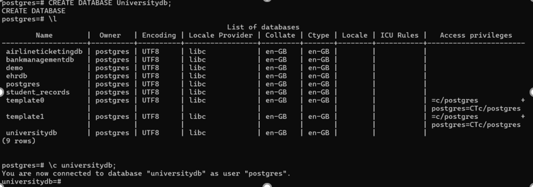

#### Before learning 
----
Before diving into these lessons, I was familiar with simple SELECT and INSERT commands but did not fully understand the complexities of transactions, ACID properties, and advanced SQL operations.

I also had minimal knowledge about how databases maintain consistency when multiple users interact with data simultaneously. I did not grasp the concept of transactions anf how important they are in preventing data corruption and ensuring reliability. Additionally, I was unaware of the impact that NULL values can have on queries and how they are handled differently in various SQL operations.

I believed that analyzing data in databases was mostly about retrieving records, but I now see how functions like GROUP BY, HAVING, and nested subqueries play a significant role in data summarization and analysis.

----

#### Key Takeaways from this Unit
----

In Unit 3, I explore database concepts, particularly focusing on SQL, ACID properties, transactions, and advanced querying techniques. These topics are crucial for effectively managing relational databases and ensuring data integrity.

Lesson 6 introduced me to SQL as the standard language for relational database management systems (RDBMS). I learned about SQL's different components, including Data Definition Language (DDL) for creating and modifying database structures and Data Manipulation Language (DML) for querying and updating data. Understanding the importance of constraints like PRIMARY KEY, FOREIGN KEY, NOT NULL, and UNIQUE helped reinforce best practices in database design.

Lesson 7 covered the ACID properties (Atomicity, Consistency, Isolation, and Durability) that ensure safe and reliable database transactions. I explored SQL operations such as SELECT, INSERT, UPDATE, DELETE, and how they maintain data integrity across multiple transactions. Learning about set operations like UNION, INTERSECT, and EXCEPT provided insights into handling complex queries efficiently.

Lesson 8 introduced advanced SQL concepts, including aggregate functions (COUNT, AVG, MIN, MAX), the GROUP BY and HAVING clauses, and nested subqueries. Additionally, I learned about NULL values and their implications in database queries. This lesson helped me understand how to optimize SQL queries and structure complex database operations effectively.

----

#### What I Learned and Why It Matters
----

1. **Understanding ACID Properties for Data Integrity**  
   ACID properties are essential for ensuring that database transactions are processed reliably. Learning how transactions maintain atomicity and consistency reinforced my understanding of how databases prevent data corruption and loss.

2. **Writing and Optimizing SQL Queries**  
   SQL is the backbone of data management, and mastering its commands has improved my ability to query, modify, and manage databases effectively. Writing optimized queries ensures better performance, especially when working with large datasets.

3. **Handling NULL Values and Set Operations**  
   NULL values can introduce inconsistencies in queries, making it essential to understand how they interact with relational operations. Learning about set operations helped me see how SQL handles comparisons and filtering data from multiple tables.

4. **Using Aggregate Functions for Data Analysis**  
   Aggregate functions allow for summarizing data, making it easier to analyze trends and insights within a dataset. Understanding GROUP BY and HAVING clauses provided more control over how data is structured and retrieved.

5. **Nested Subqueries for Complex Queries**  
   Nested subqueries enable more advanced querying by allowing one query to be used within another. This is particularly useful for filtering, comparing, and analyzing data in large-scale databases.

----

#### Personal Growth and Reflection
-----

Before these lessons, my understanding of databases was limited to basic table structures and simple SQL queries. However, learning about ACID properties and transactions changed my perspective on how databases ensure consistency, even when handling concurrent user interactions.

Additionally, working with complex SQL queries and optimization techniques improved my problem-solving skills. Writing efficient SQL statements requires logical thinking, and I have developed a stronger analytical mindset when approaching data management challenges.

----

#### Including My Work from Class
----

----
Das Ende(The End)

