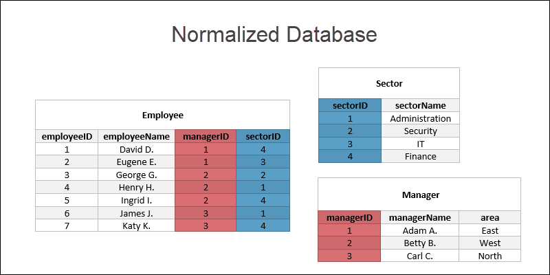
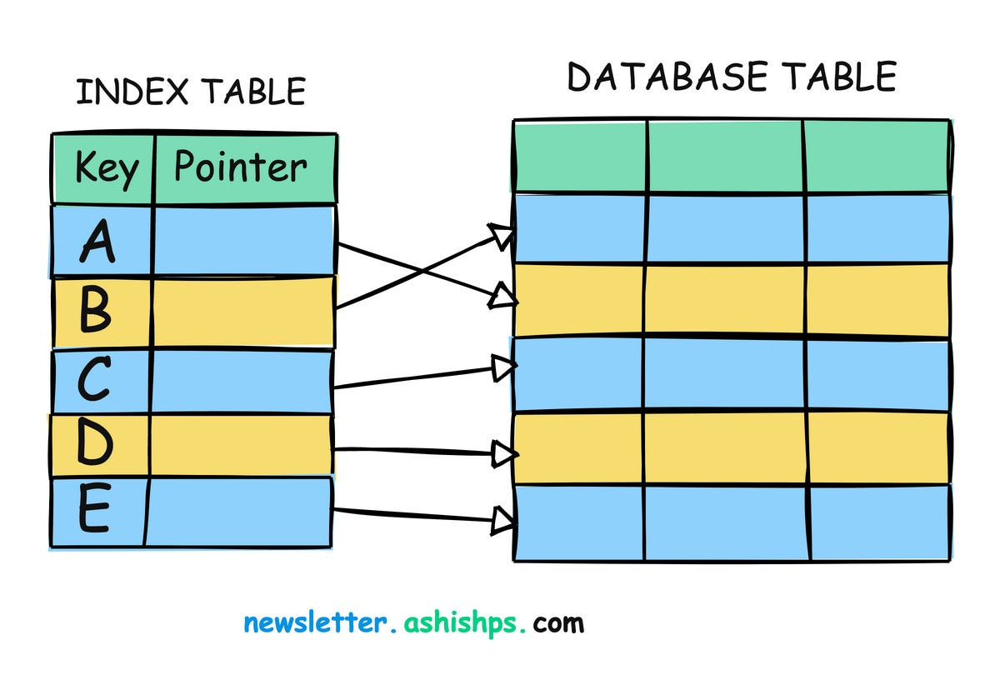
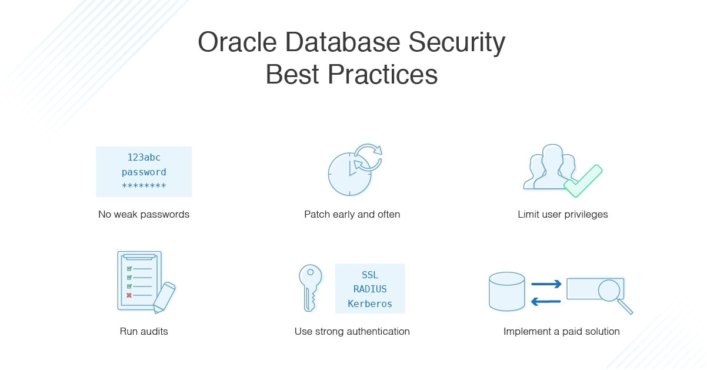

#### Before learning 
----
Before diving into these lessons, I was familiar with simple SELECT and INSERT commands but did not fully understand the complexities of transactions, ACID properties, and advanced SQL operations.

I also had minimal knowledge about how databases maintain consistency when multiple users interact with data simultaneously. I did not grasp the concept of transactions and how important they are in preventing data corruption and ensuring reliability. Additionally, I was unaware of the impact that NULL values can have on queries and how they are handled differently in various SQL operations.

I believed that analyzing data in databases was mostly about retrieving records, but I now see how functions like GROUP BY, HAVING, and nested subqueries play a significant role in data summarization and analysis.

----

#### Key Takeaways from this Unit
----

In Unit 4, I explore database concepts, particularly focusing on normalization, indexing, and database security. These topics are crucial for effectively managing relational databases and ensuring data integrity.

Lesson 9 introduced me to normalization as a process of organizing data to reduce redundancy and improve data integrity. I learned about the different normal forms (1NF, 2NF, 3NF, and BCNF) and how to apply them to database design.

Lesson 10 covered indexing and its role in improving query performance. I explored different types of indexes, such as clustered and non-clustered indexes, and learned how to use them effectively to optimize database operations.

Lesson 11 focused on database security, including user authentication, access control, and encryption. I also learned about SQL injection attacks and how to prevent them by using parameterized queries and other best practices.

Lesson 12 explored database backup and recovery strategies, which are essential for ensuring data availability and minimizing downtime in case of failures. I learned about different types of backups, such as full, incremental, and differential backups, and how to implement them effectively.

----

#### What I Learned and Why It Matters
----

1. **Normalization for Efficient Database Design**  
   Normalization helps eliminate data redundancy and ensures data consistency. Understanding how to apply normal forms has improved my ability to design efficient and reliable database schemas.

2. **Indexing for Performance Optimization**  
   Indexing is crucial for speeding up data retrieval in large databases. Learning about different types of indexes and their use cases has enhanced my ability to optimize query performance.

3. **Database Security Best Practices**  
   Protecting sensitive data is a critical aspect of database management. Understanding security measures like access control, encryption, and SQL injection prevention has made me more aware of how to safeguard databases.

4. **Balancing Normalization and Denormalization**  
   While normalization improves data integrity, denormalization can enhance performance in certain scenarios. Learning to balance these approaches has given me a more nuanced understanding of database design.

5. **Practical Applications of Indexing and Security**  
   Applying indexing techniques and security measures in real-world scenarios has helped me see their impact on database performance and reliability.

6. **Importance of Backup and Recovery Strategies**  
   Backup and recovery strategies are essential for ensuring data availability and minimizing downtime in case of failures. Learning about full, incremental, and differential backups has helped me understand how to protect data effectively. Additionally, understanding recovery models (simple, full, and bulk-logged) has shown me how to restore databases to a specific point in time, ensuring business continuity.

----

#### Personal Growth and Reflection
-----

Before these lessons, I underestimated the complexity of database design and the importance of security. Learning about normalization and indexing has deepened my understanding of how to create efficient and scalable databases.

Additionally, exploring database security concepts has made me more vigilant about protecting sensitive data. This unit has not only improved my technical skills but also enhanced my awareness of the ethical responsibilities of managing data.

Additionally, learning about backup and recovery strategies has emphasized the importance of being prepared for unexpected failures. Understanding how to implement and test backup plans has given me confidence in ensuring data availability and minimizing downtime. This knowledge has also made me more aware of the critical role database administrators play in maintaining business continuity.

By applying these strategies, I feel better equipped to handle real-world scenarios where data loss or corruption could have significant consequences. This lesson has reinforced the importance of proactive planning and regular testing in database management.

----

#### My Work from Class
----

----

Das Ende (The End)