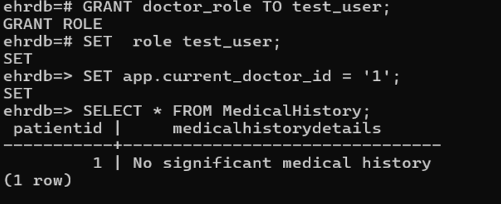

#### Before Learning  
---

Before starting this unit, I was only familiar with basic SQL operations like SELECT and INSERT. I had limited knowledge of SQL joins, views, transactions, and constraints. The concepts of indexing, authorization, triggers, and recursive queries were completely new to me.

I didn’t realize how important things like database structure, access control, and performance optimization are in real-world systems. My view of databases was mostly as storage systems, without understanding how much logic and strategy go into making them efficient, secure, and scalable.

---

#### Key Takeaways from this Unit  
---

This unit covered advanced and foundational topics that expanded my understanding of relational databases. Lessons 9, 10, 11, and 12 explored:

**Lesson 9:** SQL joins, views, transactions, integrity constraints, data types, and schemas.  
**Lesson 10:** Index creation, SQL authorization, and accessing SQL from programming languages using JDBC ODBC.  
**Lesson 11:** Creating and using functions, procedures, and triggers in SQL.  
**Lesson 12:** Writing recursive queries and using advanced SQL aggregation features.

These lessons provided both theoretical knowledge and practical application strategies.

---

#### What I Learned and Why It Matters  
---

1. **SQL Joins and Views (Lesson 9)**  
   I learned about various join types: inner joins, left/right outer joins, and full outer joins. These are essential for combining data across multiple tables. Views, including materialized views, help simplify complex queries and enhance security.  

2. **Integrity Constraints (Lesson 9)**  
   Understanding **entity**, **domain**, **referential**, and **key constraints** gave me insight into how data consistency is enforced. These constraints are foundational for building reliable databases.

3. **SQL Indexing (Lesson 10)**  
   I discovered that indexes significantly improve performance by speeding up data retrieval. Commands like `CREATE INDEX` and `CREATE UNIQUE INDEX` let us build efficient lookups on key attributes.

4. **SQL Authorization (Lesson 10)**  
   I learned how to manage access to data using **GRANT** and **REVOKE** commands. These help control who can read, insert, update, or delete data. The concept of **roles**, **row-level security**, and **grant graphs** added depth to my understanding of database security.

5. **Accessing SQL from Programming Languages (Lesson 10)**  
   I now know how **JDBC** and **ODBC** allow integration of SQL with programming languages. This is crucial for building database-driven applications, especially with **dynamic** and **embedded SQL** techniques.

6. **Functions and Procedures (Lesson 11)**  
   I learned to define reusable blocks of logic inside the database using **functions** and **procedures**. Functions return values and can be used inside queries, while procedures perform actions like inserting or validating data. This made SQL feel more like a real programming language.

7. **Triggers (Lesson 11)**  
   Triggers were fascinating—they execute automatically when certain conditions are met (like inserts or updates). I learned how to write trigger functions, use them for integrity enforcement, and when **not** to use them to avoid complications like recursive chains.

8. **Recursive Queries (Lesson 12)**  
   Recursive queries using `WITH RECURSIVE` are used to solve problems involving hierarchical data, like organizational charts or folder structures. I learned how a recursive CTE is built with a base case and a recursive step.

9. **Transitive Closure in SQL (Lesson 12)**  
   The concept of transitive closure—like computing all connections between nodes—is powerful and now achievable using recursion.

10. **Limitations of Recursive Queries (Lesson 12)**  
    Recursive SQL must remain **monotonic**, meaning it can’t use aggregations, `NOT EXISTS`, or set differences within the recursive step. This taught me how to structure recursive logic carefully.

---

#### Personal Growth and Reflection  
---

Before these lessons, I didn’t know how deep database systems go beyond storing data. Lesson 9 helped me appreciate the role of integrity constraints, while Lesson 10 opened my eyes to performance tuning through indexing and secure data access with authorization techniques.

Lesson 11 gave me a real programming mindset within SQL. I now see how functions and procedures allow clean, reusable logic and how triggers can automate important tasks directly in the database.

Lesson 12 was especially impactful—it gave me tools to work with recursive structures, which is something I never thought SQL could handle.

Understanding the integration of SQL with programming languages gave me a better view of how backend systems work. I feel more confident now in designing scalable, secure databases and handling more complex SQL tasks.

---

#### My Work from Class  
---

---

**Das Ende (The End)**
