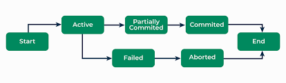
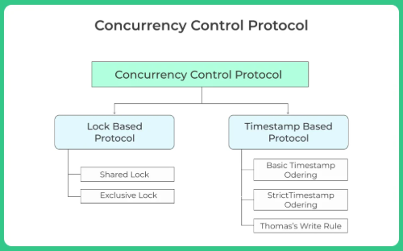

# 🎓 DBS101 Unit 7 — Transactions, Concurrency & Recovery

---

## 🚦 Before Learning

Before diving into Unit 7, I thought database transactions were just optional features — like wrapping a few queries in a `BEGIN` and `COMMIT`. I had no idea how deep the topic went or how critical these concepts were to the **reliability** and **consistency** of modern systems.

Terms like **ACID**, **deadlocks**, and **ARIES recovery** sounded technical and intimidating. But now, I see how they form the **backbone of trust** in systems like banking apps, online shopping, or any service that can’t afford to lose or corrupt data.

---

## 🧩 Key Takeaways from This Unit

---

### 🔹 **Lesson 18 – Understanding Transactions & ACID**

- A **transaction** is a sequence of database operations that forms a single, reliable unit of work.
- The famous **ACID properties** ensure data integrity:
  - **Atomicity** 💥 – All or nothing.
  - **Consistency** ✅ – From one valid state to another.
  - **Isolation** 🔐 – Transactions don’t interfere with each other.
  - **Durability** 💾 – Once committed, changes stay—even after a crash.

🧪 **Example:**  
Transferring $50 from account A to B involves updating both balances. If one update happens but the other fails, the system must roll everything back to maintain consistency.

---

### 🔹 **Lesson 19 – Concurrency Control in Action**

- Databases allow **multiple users** to access data at the same time — but this opens the door to conflicts.  
- **Locking protocols** prevent data corruption:
  - **Shared (S)** 🔍 – read-only locks
  - **Exclusive (X)** ✏️ – write locks
- **Two-Phase Locking (2PL)** ensures consistency by:
  - Acquiring all locks first (growing phase)  
  - Releasing them later (shrinking phase)

⚠️ **Deadlocks** can occur when two transactions wait on each other forever. These are resolved by:
- **Detection** (using a graph)  
- **Prevention** (wait-die, wound-wait)

🔧 **Intention locks** (IS, IX, SIX) allow scalable locking for different levels (e.g., row vs table).

---

### 🔹 **Lesson 20 – Recovery to the Rescue**

Things go wrong. Power fails. Systems crash. And databases must recover.

- **Logging (Write-Ahead Logging)** records every change before applying it to the database.
- **Undo/Redo mechanisms** use logs to:
  - Roll back failed transactions.
  - Reapply committed changes if not yet saved.

🧠 **ARIES Algorithm** (Analysis → Redo → Undo) is a powerful recovery method used in real-world DBMSs.

🛟 **Checkpoints** reduce the work needed during recovery.  
💡 **Fuzzy checkpoints** allow updates during checkpointing without blocking users.

💾 Even **main-memory databases** have optimized recovery to survive crashes by syncing periodically to disk.

---

## 💡 What I Learned and Why It Matters

✅ Transactions are more than just SQL wrappers—they're **safety nets** that ensure trust in digital systems.  
✅ Concurrency isn’t chaos when you have locks, schedules, and serializability.  
✅ Recovery isn’t just a backup — it’s a smart, rule-based **self-healing process**.  
✅ The database knows how to recover from crashes better than I expected — and that’s comforting.

> 💬 Without these systems in place, a crash could destroy hours of user work. That’s not acceptable — and now I understand how databases prevent that.

---

## 🚀 Personal Growth & Reflection

Before Unit 7, I assumed databases were like black boxes — they magically stored and retrieved data. But now I see them as **complex, resilient machines** built with layers of safeguards.

Learning about **ACID, deadlocks, locking protocols, and ARIES** gave me a new appreciation for how much engineering goes into **making things look simple to the user**.

Knowing this makes me feel more confident — not just in writing queries, but in designing reliable systems that handle **real-world failures gracefully.**

---

## 🛠️ Including My Work from Class

### ✅ **Lesson 18 – Transactions**
- Practiced PostgreSQL transactions with `BEGIN`, `COMMIT`, `ROLLBACK`.
- Simulated fund transfers using ACID principles.

### ✅ **Lesson 19 – Concurrency**
- Used shared/exclusive locks in examples.
- Simulated deadlocks and resolved them using **waits-for graphs**.
- Explored 2PL, intention locks, and granularity management.

### ✅ **Lesson 20 – Recovery**
- Wrote and analyzed log entries (`<Ti, Xj, old, new>`).
- Applied ARIES-style redo/undo manually in exercises.
- Understood checkpoints, crash recovery, and WAL.

---

## 🏁 Das Ende (The End)

Unit 7 has taught me that databases are not just about storing data — they’re about **protecting it**, **recovering it**, and **managing it under pressure**. And that’s what makes them powerful.
