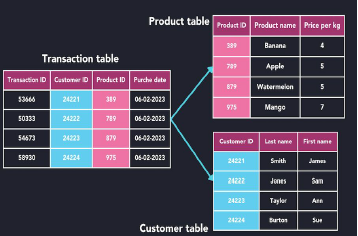

### Topic - Database Systems Fundamentals
----

#### Key Takeaways
----

#### Data, DataBase, DataBase Management System
Data is facts, a database organizes data for easy access, and a DBMS is software that manages databases efficiently.

Databases and DBMS improves data management, security, and accessibility but can be costly, complex, and require strong infrastructure.

The database system is now one of the most valuable assets in the digital world. Companies use databases to store, analyze, and secure large amounts of data, making informed
decisions that give them a competitive edge.

#### History of DataBase
-**1950s-1960s (File Systems)** – Early databases used simple file systems for data storage with no structured management. 
-**1970s (Hierarchical & Network Databases)** – IBM’s IMS introduced hierarchical models, while CODASYL developed network databases for better data relationships. 
-**1980s (Relational Databases - RDBMS)** – Edgar F. Codd introduced the relational model (SQL-based) for efficient data management, leading to systems like Oracle and MySQL. 
-**1990s-2000s (Object-Oriented & NoSQL Databases)** – Object-oriented databases emerged, followed by NoSQL databases like MongoDB for handling large, unstructured data. 
-**2010s-Present (Cloud & Big Data Databases)** – Cloud databases and big data technologies enable scalable and high-performance data management.

#### Data Model
Defines how data is structured, stored, and managed in a database. It provides a blueprint for organizing data and relationships.  

Types of Data Models:
1. Entity Relationship Model - conceptual framework used to design and represent the structure of a database
2. Semi-structured Data Model - flexible model that does not follow a strict schema like relational databases but still maintains some structure using tags or markers.
3. Object Based Data Models - designed to handle complex data and relationships efficiently.
4. Relational Model - it stores data in tables and defines relationships between the data using key.

#### Early Database management
System were hard to build and difficult to maintain. They had to know what queries the application it would execute.

#### Edgar F. Codd
Introduced the relational model in 1970. This model organized data into tables with rows and columns, simplifying data storage and retrieval.

#### Relational Model 

Organizing data into tables, where each table consists of rows and columns. 
SQL is used to create, manipulate, and manage data efficiently.

#### Data Abstraction
Hiding the details of how data is stored and maintained while exposing only the necessary parts to the user, while also managing the data . 
Physical level - how data is actually stored.  
logical level - focuses on the structure and relationships of data.

