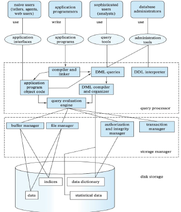

### Topic - Database Systems Fundamentals
----

#### Before learning about Database system Fundamentals
----
Before learning about database system fundamentals, I thought that it is jsut a app to store data and we can use the data stored.
I also thought that its a basic app like excel where data could be easily retrieved and updated using simple commands.. I didn’t 
realize the depth and complexity that goes into designing and managing databases efficiently.

----

#### Key Takeaways and What I have learned
----

#### Data, DataBase, DataBase Management System
Data is facts, a database organizes data for easy access, and a DBMS is software that manages databases efficiently.

Databases and DBMS improves data management, security, and accessibility but can be costly, complex, and require strong infrastructure.

The database system is now one of the most valuable assets in the digital world. Companies use databases to store, analyze, and secure
large amounts of data, making informed decisions that give them a competitive edge.

#### Database Users and Administrators
Databases are managed and used by different types of users and administrators, each with specific roles and responsibilities. These roles ensure the smooth
operation, security, and accessibility of the database.  
Users interact with the data, while administrators ensure security, performance, and reliability.
##### HOMEWORK

#### History of DataBase
-**1950s-1960s (File Systems)** – Early databases used simple file systems for data storage with no structured management. 
-**1970s (Hierarchical & Network Databases)** – IBM’s IMS introduced hierarchical models, while CODASYL developed network databases for better data relationships. 
-**1980s (Relational Databases - RDBMS)** – Edgar F. Codd introduced the relational model (SQL-based) for efficient data management, leading to systems like Oracle and MySQL. 
-**1990s-2000s (Object-Oriented & NoSQL Databases)** – Object-oriented databases emerged, followed by NoSQL databases like MongoDB for handling large, unstructured data. 
-**2010s-Present (Cloud & Big Data Databases)** – Cloud databases and big data technologies enable scalable and high-performance data management.

#### Data Model

Defines how data is structured, stored, and managed in a database. It provides a blueprint for organizing data and relationships.

Types of Data Models:
1. Entity Relationship Model - conceptual framework used to design and represent the structure of a database
2. Semi-structured Data Model - flexible model that does not follow a strict schema like relational databases but still maintains some structure using tags or markers.
3. Object Based Data Models - designed to handle complex data and relationships efficiently.
4. Relational Model - it stores data in tables and defines relationships between the data using key.

#### Early Database management
System were hard to build and difficult to maintain. They had to know what queries the application it would execute.

#### Edgar F. Codd
Introduced the relational model in 1970. This model organized data into tables with rows and columns, simplifying data storage and retrieval.

#### Relational Model 

Organizing data into tables, where each table consists of rows and columns. 
SQL is used to create, manipulate, and manage data efficiently.

#### Data Abstraction
Hiding the details of how data is stored and maintained while exposing only the necessary parts to the user, while also managing the data . 
Physical level - how data is actually stored.  
logical level - focuses on the structure and relationships of data.

#### Database Instances and Schemas
A database schema defines the structure of a database, while a database instance is the actual data stored at a specific moment

#### Database Languages
Are languages used to create, manage, and manipulate databases.  
DDL is used to define and modify database structures and DML is used to retrieve, insert, update, and delete data in a database.

#### Database Access from Application Programs
A host programming language is required to send SQL (DML) statements to a database  
ODBC (Open Database Connectivity) allowed applications to execute SQL commands and retrieve data

#### Database design
1. Data Model
2. Conceptual design
3. Logical design
4. Physical design

#### Database Engine and Architecture
The Storage Manager handles data storage, retrieval, and indexing. The Query Processor translates and optimizes queries.
Transaction Management ensures database consistency and reliability.  

----

#### Why it matters?
----

Databases are the backbone of modern applications, ensuring efficient data storage, retrieval, and management.  
It ensures that data remains accurate and consistent, allows systems to handle large amounts of data efficiently,
protects sensitive information through authentication and authorization.  
Without database systems, modern computing and digital services wouldn’t function efficiently.

----

#### Personal Growth and Reflection
----

Database System Fundamentals has expanded my understanding of data management and the importance of structured storage systems.
I learned about the purpose of database systems and their advantages over traditional systems which is the base of what we have today.
I realized how database solve problems like data redundancy, inconsistency, and security while also providing scalability and
flexibility. I leanred how databases improve decision-making, productivity, and data integrity in various fields. 
I leanred about different data models like the relational model, object-based model, and semi-structured data model. Understood how database 
organize data at different abstraction levels (physical, logical, and view levels). I learned about Edgar F. Codd’s relational model and how it 
revolutionized the way databases store and retrieve information. I also leanred that SQL enables structured queries and efficient data
manipulation reinforced the importance of learning database languages for practical applications.  
I now understand that database systems are not just about storing data but involve optimization, security, and structured design to ensure efficiency.

----
Das Ende(The End)